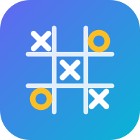

# 🎮 GridMind AI — Premium Tic-Tac-Toe Game

> *Classic Tic-Tac-Toe reimagined with a luxury UI, unbeatable AI opponent, dynamic Web Audio synthesizer, mobile haptic feedback, and modern animations.*


<div>
  
</div>

---

## 📌 Table of Contents

- [🎮 GridMind AI — Premium Tic-Tac-Toe Game](#-gridmind-ai--premium-tic-tac-toe-game)
  - [📌 Table of Contents](#-table-of-contents)
  - [📖 About the Project](#-about-the-project)
  - [🌐 Live Demo](#-live-demo)
  - [✨ Key Upgrades \& Features](#-key-upgrades--features)
  - [🕹️ Game Modes](#️-game-modes)
  - [🧠 AI Engine \& Minimax](#-ai-engine--minimax)
  - [🎨 Luxury Themes](#-luxury-themes)
  - [🔊 Sound \& Music Synthesizer](#-sound--music-synthesizer)
  - [📱 Mobile \& Haptic Integration](#-mobile--haptic-integration)
  - [🛠️ Tech Stack](#️-tech-stack)
  - [📁 Project Structure](#-project-structure)
  - [🚀 Getting Started](#-getting-started)
    - [1. Clone the Repository](#1-clone-the-repository)
    - [2. Launch in Browser](#2-launch-in-browser)
  - [👨‍💻 Developer](#-developer)

---

## 📖 About the Project

**GridMind AI** is a premium, high-performance browser-based Tic-Tac-Toe game built with **pure HTML5, CSS3, and JavaScript**. Rebuilt from the ground up to deliver a luxury gaming experience with:
- Glassmorphism & custom glowing micro-interactions
- Real-time Web Audio API sound synthesis and ambient music
- Unbeatable Minimax AI with Alpha-Beta Pruning
- Mobile-native haptic feedback (`navigator.vibrate`)
- Particle celebrations & SVG vector draw animations

No external framework or library dependencies — 100% lightweight and instant-loading!

---

## 🌐 Live Demo

🔗 **[https://tic-tac-toe-game-nine-fawn.vercel.app/](https://tic-tac-toe-game-nine-fawn.vercel.app/)**

---

## ✨ Key Upgrades & Features

- 🤖 **Minimax AI** — Play against an unbeatable AI using Alpha-Beta Pruning or choose easier adaptive modes.
- 👥 **2 Game Modes** — Player vs Player and Player vs AI.
- 🎨 **4 Luxury Themes** — Midnight 🌙, Aurora 🌌, Crimson 🔥, and Frost ❄️.
- 🎵 **Web Audio API Synth** — Real-time synthesized sound effects (pops, blips, victory fanfares) and an ambient background pad oscillator.
- 📳 **Haptic Feedback Integration** — Custom vibration responses for moves, victories, draws, clicks, and invalid move alerts on supported mobile devices.
- 🎆 **Particle & Confetti Engine** — High-performance custom canvas/DOM particle explosions on victories.
- ⏱️ **Game Timer & Win Streak Tracker** — Live round timer and win streak fire counter.
- 📱 **Mobile-First Responsive** — PWA meta tags, safe-area support, double-tap zoom prevention, and touch ripple effects.
- 🚀 **Animated Splash Screen** — Smooth SVG vector draw logo animation on startup.

---

## 🕹️ Game Modes

| Mode | Description |
|---|---|
| 👥 **Player vs Player** | Two players take turns locally on the same device |
| 🤖 **Player vs AI** | Single-player challenge against the GridMind AI algorithm |

---

## 🧠 AI Engine & Minimax

| Level | Behaviour |
|---|---|
| 😊 **Easy** | Random moves — ideal for casual practice |
| 🧠 **Medium** | Adaptive probabilistic AI (70% optimal / 30% random) |
| 💀 **Hard** | Minimax Algorithm with Alpha-Beta Pruning — 100% Unbeatable |

---

## 🎨 Luxury Themes

| Theme | Description | Aesthetic |
|---|---|---|
| 🌙 **Midnight** (Default) | Deep navy & violet luxury | Cyan, Hot Pink, Gold & Violet Glassmorphism |
| 🌌 **Aurora** | Northern lights dark theme | Mint, Emerald, Purple & Glowing Accents |
| 🔥 **Crimson** | Bold red & gold premium style | Crimson, Amber, Gold & Warm Illumination |
| ❄️ **Frost** | Light glassmorphism elegance | Ice Blue, Lavender & Clean Silver Glass |

---

## 🔊 Sound & Music Synthesizer

Rather than relying on bulky audio files, GridMind AI uses the **Web Audio API** to generate all audio programmatically:
- **Move X**: Rising sine wave pop (400Hz → 900Hz)
- **Move O**: Deep triangle wave blip (300Hz → 550Hz)
- **Win Fanfare**: Triumphant 4-note ascending chord (C5-E5-G5-C6)
- **Draw Sound**: Gentle 2-note neutral chime
- **Click**: Crisp UI tap (1200Hz square wave)
- **Error Tone**: Low sawtooth alert for invalid grid moves
- **Background Ambient Music**: Multi-oscillator detuned ambient synth pad with LFO modulation

---

## 📱 Mobile & Haptic Integration

- **Haptic Vibrate Patterns**:
  - Grid Move: `15ms` pulse
  - Victory: `[50ms, 30ms, 50ms, 30ms, 100ms]` celebration sequence
  - Draw: `[30ms, 20ms, 30ms]` dual pulse
  - Invalid Move: `[20ms, 10ms, 20ms]` error buzz
- **PWA Ready**: Web app capable meta tags, dark translucent status bar, and native feel.
- **Viewport Control**: Prevents unwanted pinching or double-tap zooming during intense gameplay.

---

## 🛠️ Tech Stack

| Technology | Purpose |
|---|---|
| **HTML5** | Semantic structure, PWA meta tags, SVG vector rendering |
| **CSS3** | Glassmorphism, 3D transform flips, CSS Custom Variables, SVG stroke keyframes |
| **JavaScript (ES6+)** | Minimax AI engine, Web Audio API synthesis, Haptics API, DOM particle system |

---

## 📁 Project Structure

```
GridMind-AI/
│
├── index.html          # Main game page with SVG logo & splash overlay
├── Style.css           # 4 Luxury themes, glassmorphism, responsive styles & animations
├── Script.js           # Audio engine, Minimax AI, Haptics, particle burst, game logic
├── README.md           # Documentation
└── assets/             # Static brand assets
     └── GridMind.svg   # Game SVG icon
```

---

## 🚀 Getting Started

No dependencies or build steps required. Simply open and play:

### 1. Clone the Repository
```bash
git clone https://github.com/ktirumalaachari/Tic-Tac-Toe-Game.git
```

### 2. Launch in Browser
```bash
# On Windows
start index.html

# On macOS
open index.html
```

<div align="center">

## 👨‍💻 Developer

**K Tirumala Achari**  
Full Stack Developer | Aspiring Software Engineer

<a href="mailto:ktirumalachari@gmail.com">
  
</a>
<a href="https://www.linkedin.com/in/k-tirumala-achari-921106307/">
  
</a>
<a href="https://github.com/ktirumalaachari">
  
</a>
<a href="https://www.ktirumalaachari.me">
  
</a>
<br/><br/>

> _"Passionate about building impactful, user-centric solutions through technology,_
> _committed to continuous learning and innovation."_

<div align="center">
**⭐ If you found this project helpful or inspiring, please give it a star! ⭐**

<br/>
Made with ❤️ by **K Tirumala Achari**

[](https://github.com/ktirumalaachari)

</div>